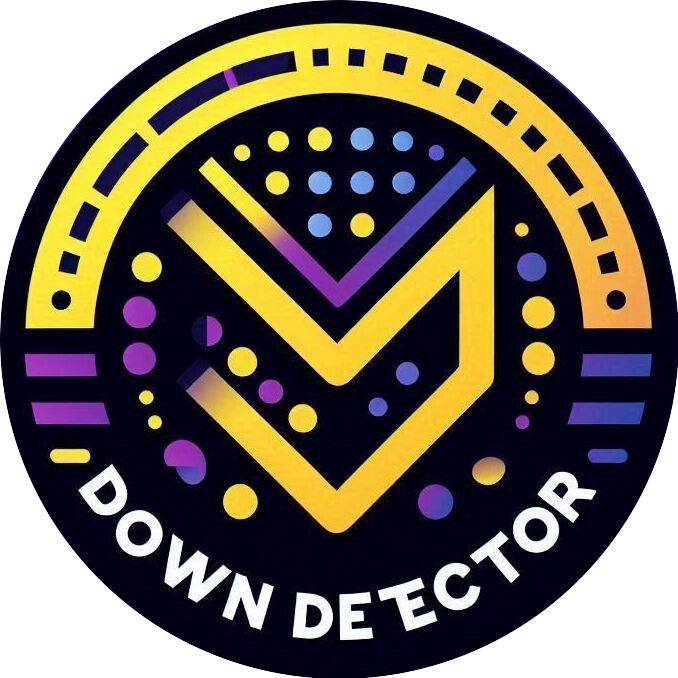
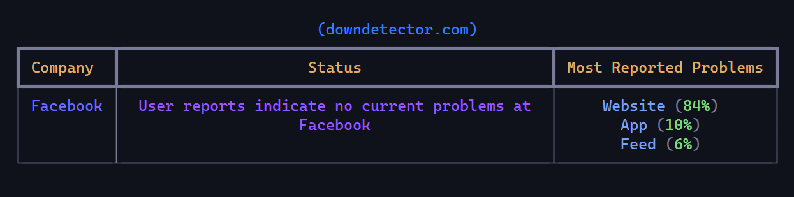

<div align="center">



**Down-Detector** provides real-time problem & outage monitoring.



</div>

## **Installation**

**Using** _`poetry`_

```
git clone https://github.com/x404xx/Down-Detector.git
cd Down-Detector
poetry shell
poetry install
```

**Using** _`pip`_

```
git clone https://github.com/x404xx/Down-Detector.git
cd Down-Detector
virtualenv env
env/scripts/activate
pip install -r requirements.txt
```

## Usage Example

```bash
python -m detector 'facebook'
```

## **Legal Disclaimer**

> [!Note]
> This was made for educational purposes only, nobody which directly involved in this project is responsible for any damages caused. **_You are responsible for your actions._**
